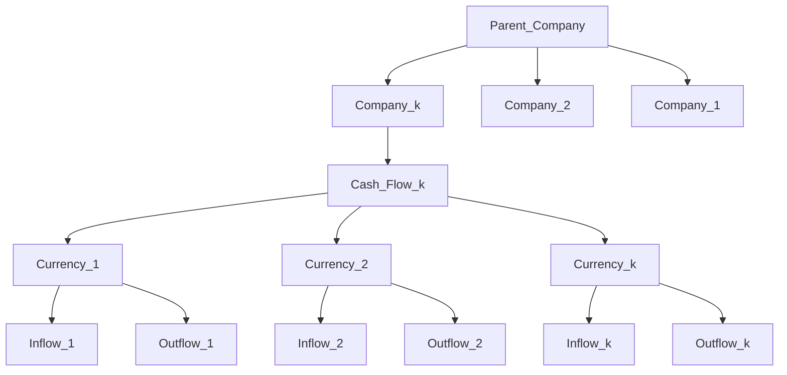
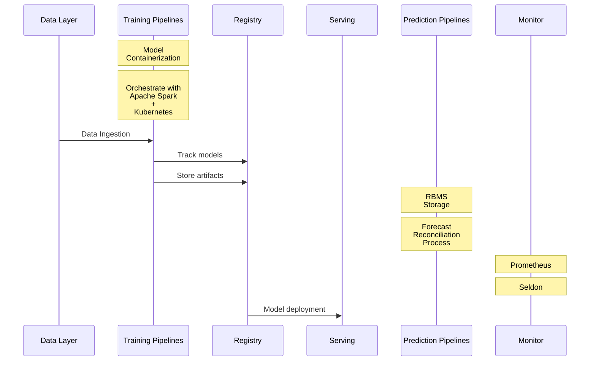

# Further steps of extending the system

**Question: How would we extend the process if we have 15 different currencies?**

**Answer:** One simple way we can extend the process is by training a single panel model like e.g. `LightGBM` and pass the currency index as a predictor to the model. The prediction process can be performed on bulks, by recursively regenerating the features for the $i^{th}$ ahead forecast.

As we saw in the initial data analysis, many of the currencies are quite similiar. If we want a more diverse set of models to try out, we can we can try models, like `SARIMA`, `ETS`, `Prophet` and so on. The models can be compared and logged in an `artifact storage` like the one `MLFlow` provides. Additional to each model, we can store it's performance information which can be used to select a production level model for the particular granularity.

**Question: How would we extend the process if we have different flows of cash?**

**Answer:** Again, like in the above process, we can use a single model or many different ones. 

**Question: How would we extend the process if we have different companies?**

**Answer:** Depends on whether the companies are child companies of another parent company and the information could be shared or whether we are talking about replication of our system. If the second, we can use our ready system like a product, deployed on different servers, with different configurations for the different  companies.

In case of some commonality between the companies, we can introduce another level of granularity in our hierarchical structure. The final structure would look something like this

We can further extend the process by introducing reconciliation in the above hieararchical structure.

**Question: How would you deal with orchestrating many different models, automating and monitor them?**

**Answer:** An example architecture would be one where we ingest the data into a `Training Pipelines` steps. This is where we would take care of training orchestration of different levels of granularity. Example tools we can use a re `Kubeflow`, `AWS EMR`, `Apache Spark`, etc.

We need to track our models and their artifacts. `MLFlow` is the most popular tool for that. We can also use `Mlflow` for model deployment.

The deployed models on different granularities can be fed to a the `Prediction Pipeline` jobs.

We can monitor the models with `Prometheus` and `Seldon`.

Picture below

